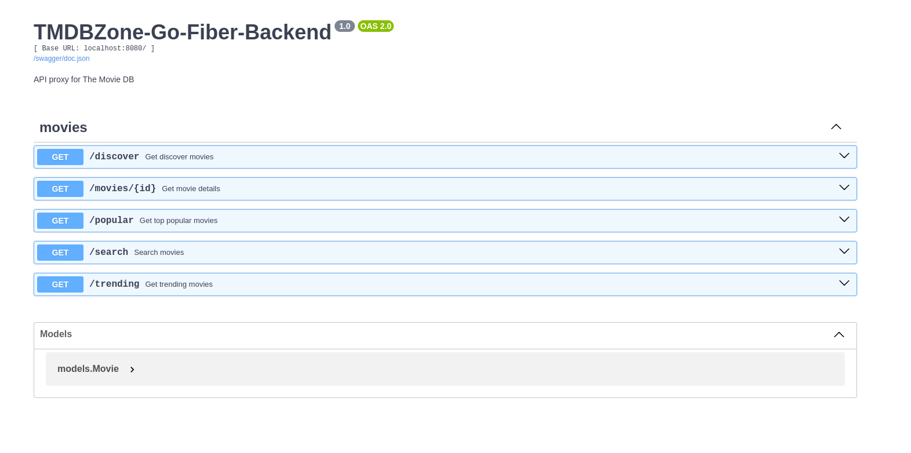

# TMDBVerse-Go-Fiber-Redis-Backend

This is the backend of The MovieDB Verse project, it contains integration with The Movie DB Api.

## Tech Stack

<div style="display: flex; align-items: center;">
  
   
   
   
</div>

## Features

- Complete integration with **The Movie Database API**
- Real-time movie data fetching  
- Intelligent **Redis** caching system for API responses and reduced external API calls
- Interactive API documentation with **Swagger**
- Clean separation of concerns with Hexagonal Architecture
- Organized in handlers, services and models
- Single-command setup with `docker-compose` with a pre-configured Redis service

## How to Use

1. **Clone the repository**:

```bash
   git clone https://github.com/A4GOD-AMHG/TMDBVerse-Go-Fiber-Redis-Backend.git

   cd TMDBVerse-Go-Fiber-Redis-Backend
```

2. **Configure environment variables:**

- Change name of the example environment file example.env to .env:

- Edit the .env file with your credentials:

```bash
TMDB_API_ACCESS_TOKEN=your_tmdb_api_token_here
REDIS_URL=redis://localhost:6379
```

3. **Launch the application:**

```bash
docker-compose up --build
```

## Frontend Setup

For the React frontend implementation, please go to the [TMDBVerse-React-TailwindCSS-Frontend](<https://github.com/A4GOD-AMHG/TMDBVerse-React-TailwindCSS-Frontend.git>)

## Screenshots



## Author

- Alexis Manuel Hurtado García (<https://github.com/A4GOD-AMHG>)
  